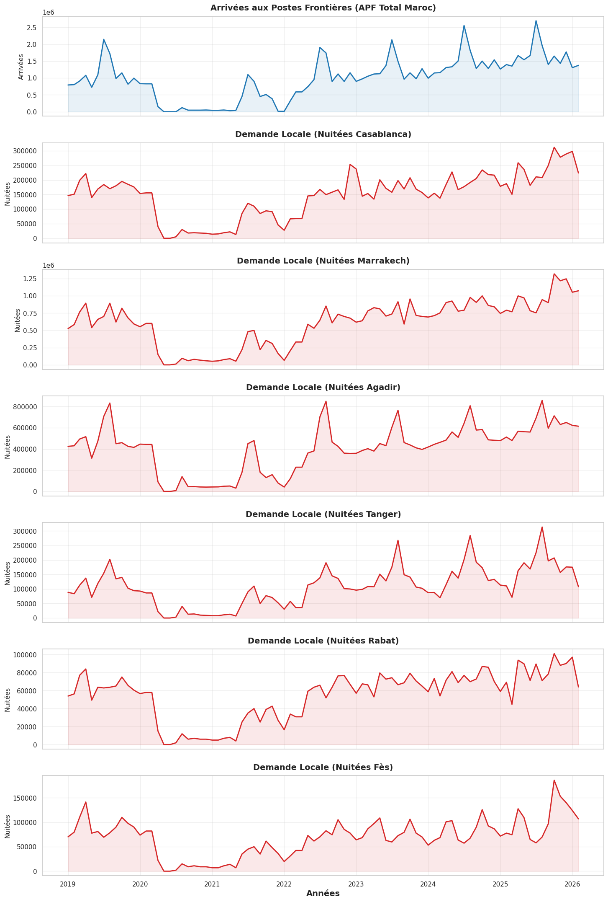
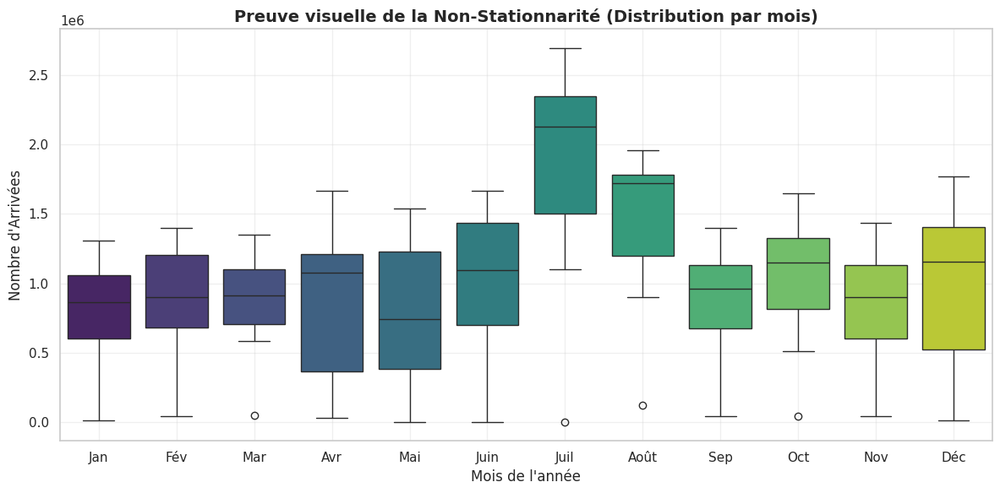
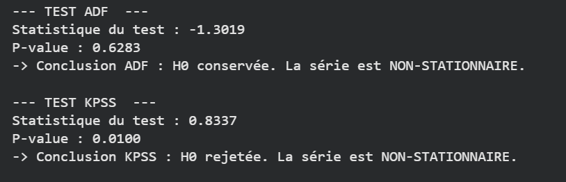
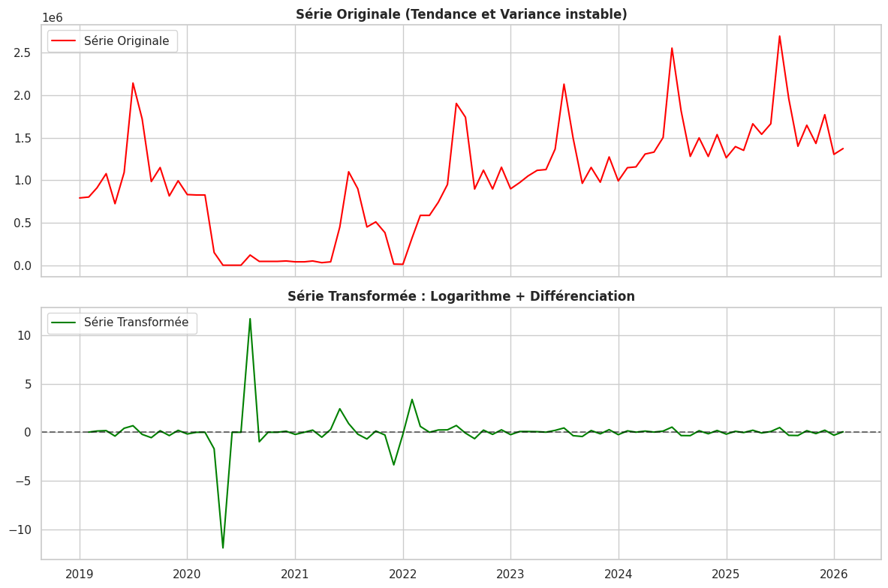
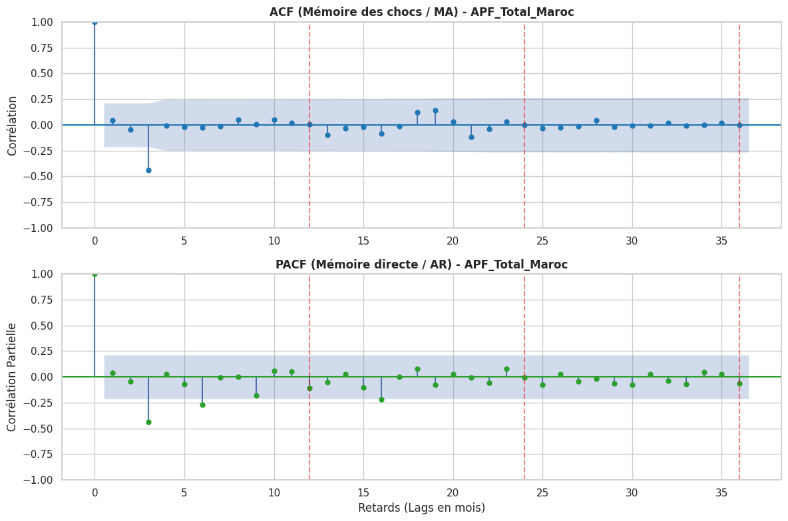
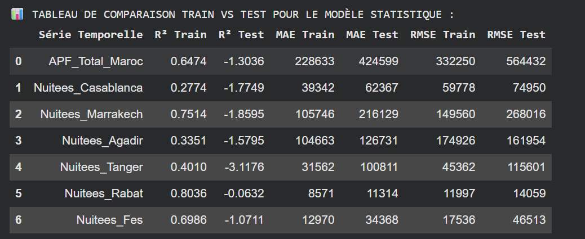
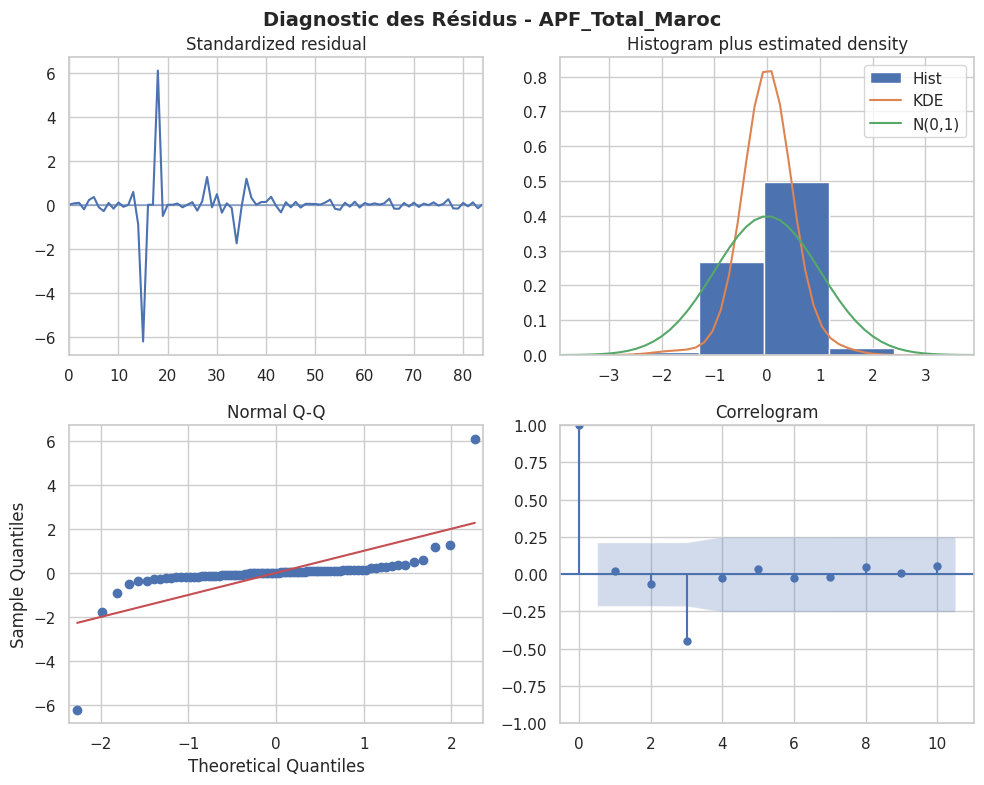
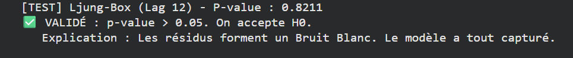
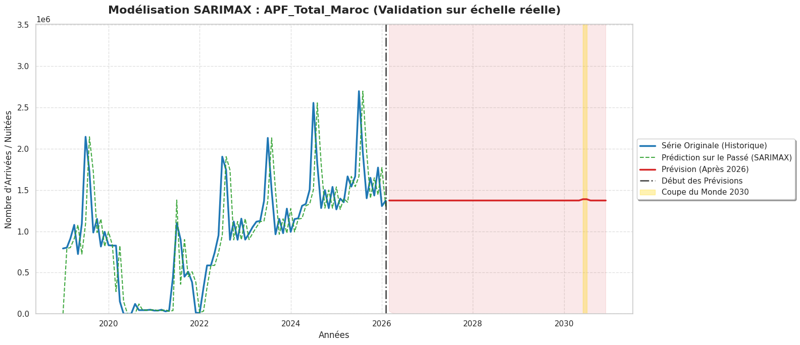

# Chapitre 2 : Modélisation Économétrique (SARIMAX) - Application et Limites

Avant de déployer des architectures d'Intelligence Artificielle complexes, la rigueur scientifique exige d'évaluer les capacités des méthodes statistiques traditionnelles. Cette première phase applique de manière stricte le **pipeline analytique de séries temporelles proposé par le Professeur Masrour**,et l'appliquant sur chaque serie temporelle et en utilisant la série macroéconomique `APF_Total_Maroc` comme variable témoin (Pilote) du fait que tous les series presentent des caractéristiques architecturales identiques. 

---

## 1. Observation et Diagnostic de la Non-Stationnarité

La première étape du pipeline consiste à observer la morphologie brute des données. L'analyse visuelle de la série des Arrivées aux Postes Frontières (APF) révèle deux composantes majeures :
* **Une tendance de fond (Trend) :** Croissance globale du tourisme au Maroc sur la décennie.
* **Une forte saisonnalité :** Des pics systématiques récurrents (période estivale).

### A. Les Boîtes à Moustaches (Boxplots)
Pour confirmer visuellement la variance, nous avons tracé des boîtes à moustaches par année et par mois. Elles démontrent clairement une **hétéroscédasticité** : l'amplitude (la variance) des flux touristiques augmente avec le temps, et la répartition mensuelle confirme des "saisons hautes" très marquées.

### B. Tests Statistiques (ADF & KPSS)
Pour valider rigoureusement cette non-stationnarité, nous avons appliqué les tests de Dickey-Fuller Augmenté (ADF) et KPSS. 
* **Le Test ADF** n'a pas permis de rejeter l'hypothèse nulle ($H_0$) de présence d'une racine unitaire.
* **Conclusion :** La série brute est officiellement non-stationnaire. Il est mathématiquement impossible d'y appliquer un modèle ARIMA en l'état.

---

## 2. Stabilisation Mathématique : Transformations et Différenciations

Pour rendre la série stationnaire (moyenne et variance constantes dans le temps), nous lui avons fait subir deux traitements successifs :

1. **Transformation Logarithmique :** Application du $Log$ naturel pour "écraser" la variance (corriger l'hétéroscédasticité et les effets exponentiels).
2. **Différenciation :** Application d'une différenciation simple (pour annuler la tendance) couplée à une différenciation saisonnière (pour annuler les cycles annuels).

L'impact de ces opérations est frappant. Comme le montre la figure ci-dessous, la série temporelle passe d'une courbe en constante évolution à un signal oscillant autour de zéro, validé stationnaire par un nouveau passage aux tests ADF/KPSS.

###  Limite Mathématique face au Choc Exogène (Le cas du Covid-19)

Bien que les tests statistiques (ADF/KPSS) valident techniquement le nouveau régime de la série, l'observation minutieuse de la courbe différenciée révèle une anomalie incontournable : la variance explose de manière chaotique autour de la période 2020-2021, empêchant la série d'être un "bruit blanc" parfait.

Loin d'être une erreur méthodologique, cette turbulence est la traduction mathématique exacte d'une **Rupture Structurelle** sans précédent : la fermeture stricte des frontières liée au confinement sanitaire. 

* **L'explication technique :** Les transformations continues (comme le Logarithme) et linéaires (comme la différenciation) sont conçues pour lisser une volatilité économique naturelle. Elles sont cependant impuissantes face à un événement d'arrêt binaire ("On/Off"). Le passage soudain de centaines de milliers de touristes à un zéro absolu génère une discontinuité mathématique majeure que la différenciation simple ne peut absorber.

**La Valeur Ajoutée de cette observation :** Cette "imperfection" visuelle est la justification absolue de l'utilisation du modèle **SARIMAX** (le "X" signifiant *eXogenous*). Un simple modèle ARIMA aurait été mathématiquement détruit par cette variance. C'est précisément pour neutraliser cette anomalie que nous avons forcé le modèle à intégrer la variable exogène `Pandemie`, lui permettant de séparer le choc sanitaire de la véritable dynamique touristique.

---

## 3. Identification des Paramètres (ACF / PACF) et Auto-ARIMA

### A. Analyse des Corrélogrammes
Pour orienter l'algorithme de recherche, nous avons tracé les fonctions d'Autocorrélation (ACF) et d'Autocorrélation Partielle (PACF) sur la série stationnarisée. 
* Le graphique **ACF** nous a permis de repérer les "retards" significatifs pour borner l'intervalle de la composante Moyenne Mobile ($q, Q$).
* Le graphique **PACF** a servi à identifier les intervalles pertinents pour la composante Autorégressive ($p, P$).

### B. Optimisation via `auto_arima`
Au lieu de tester manuellement toutes les combinaisons, nous avons contraint l'algorithme `auto_arima` à chercher dans les intervalles définis par nos corrélogrammes. L'algorithme a balayé l'espace des solutions pour extraire le modèle SARIMAX $(p,d,q)(P,D,Q)_s$ optimal, en se basant sur la minimisation stricte du **Critère d'Information d'Akaike (AIC)**.

---

## 4. Benchmarking : SARIMAX vs Baseline Naïf

Afin d'isoler la base d'apprentissage et d'éviter tout *Data Leakage*, la série a été divisée de manière chronologique (Train / Test). 

Pour mesurer la véritable valeur ajoutée de notre modèle SARIMAX optimisé, nous l'avons confronté à un modèle "Baseline Naïf" (qui postule simplement que la valeur $y_{t+1}$ sera identique à $y_t$).

**Analyse des métriques :** Le modèle SARIMAX surpasse largement le modèle Naïf sur la phase d'entraînement (In-Sample). Cependant, lors de la projection sur l'ensemble de Test (Out-of-Sample), l'erreur (RMSE) augmente de façon significative. Le modèle statistique peine à s'adapter aux ruptures brutales récentes (volatilité post-crise).

---

## 5. Validation du Modèle : L'Analyse des Résidus

La dernière étape du pipeline du Prof. Masrour exige de vérifier que le modèle a bien extrait toute l'information utile. Pour cela, nous avons analysé ses résidus (les erreurs de prédiction) :
1. **Test de Ljung-Box :** Confirme l'absence d'autocorrélation dans les résidus.
2. **Distribution :** L'histogramme des résidus suit une distribution globalement normale (centrée sur 0).

**Conclusion de l'étape :** Les résidus s'apparentent à un **Bruit Blanc**. Le modèle SARIMAX est donc mathématiquement valide et prêt pour le forecasting.

---

## 6. Analyse Critique : Le Phénomène des "Prévisions Plates"

Malgré la validation de toutes les étapes du pipeline mathématique, le déploiement du modèle SARIMAX sur un horizon futur lointain (jusqu'en 2030) aboutit à un constat d'échec visuel et fonctionnel : **la prévision s'amortit rapidement pour ne dessiner qu'une ligne quasi-plate.**

Loin d'être une erreur de code, cet aplatissement est la réponse mathématique logique d'un modèle statistique linéaire face au chaos :

1. **Minimisation du Risque (RMSE) :** Face à la volatilité extrême de notre historique (le choc massif du Covid-19), le modèle calcule que reproduire de l'amplitude générerait un risque d'erreur quadratique trop grand. Il "sécurise" sa prédiction en convergeant vers la moyenne.
2. **Pénalisation de l'AIC :** Lors de l'optimisation, l'AIC a pénalisé les paramètres autorégressifs trop forts pour éviter le surapprentissage du bruit. Conséquence : la mémoire du modèle est courte et s'estompe vite.
3. **Incapacité structurelle face à 2030 :** Un modèle SARIMAX suppose que le futur est une réplique stabilisée du passé. Il n'a aucun mécanisme interne pour imaginer l'afflux exponentiel (Le Cygne Noir) qu'engendrera la Coupe du Monde.

### Transition vers la Phase 2
Ce diagnostic implacable prouve que l'économétrie classique, bien qu'élégante mathématiquement, est **inutilisable comme outil d'aide à la décision pour 2030**. L'État et les investisseurs ne peuvent pas planifier la construction de lits d'hôtels sur la base d'une ligne plate. 

Cette limite fondamentale justifie le basculement intégral de notre projet vers les **Réseaux de Neurones Récurrents (Deep Learning)**.
