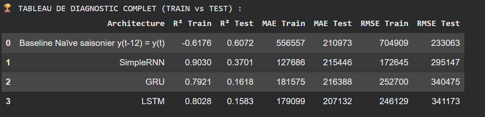
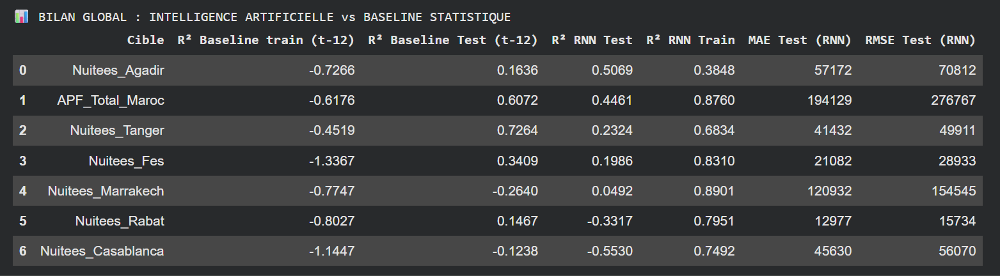
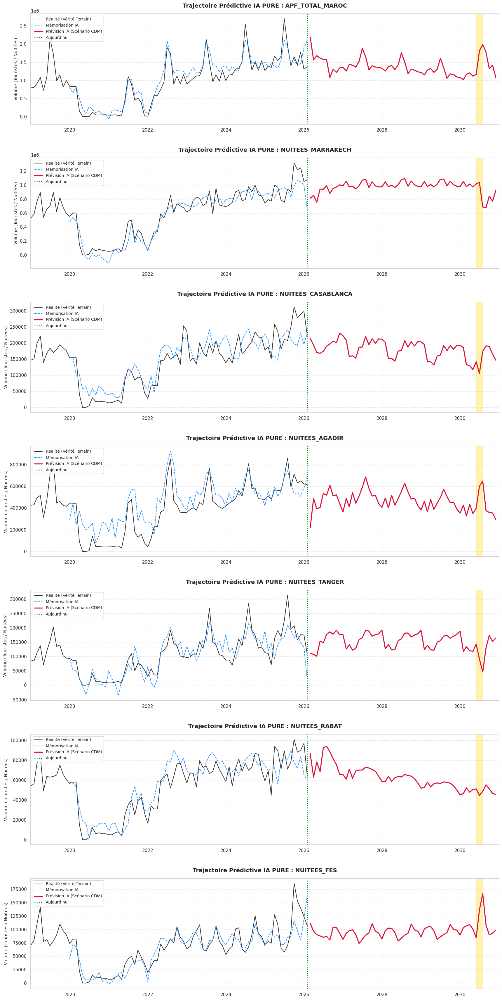

# Chapitre 3 : Modélisation Deep Learning et Architecture d'IA Hybride

Le constat d'échec des méthodes linéaires (SARIMAX) face aux ruptures de régime nous a imposé un changement de paradigme mathématique. Cette seconde phase repose sur l'implémentation de **Réseaux de Neurones Récurrents (RNN)**, capables d'apprendre des fonctions non-linéaires complexes et de conserver une "mémoire" des séquences temporelles.

---

## 1. Ingénierie des Tenseurs et Phénomène de Fenêtrage (Lookback)

Contrairement à l'économétrie classique, le Deep Learning nécessite un formatage spécifique de la donnée. Pour que le réseau comprenne la notion de séquence temporelle, nous avons transformé notre dataset tabulaire en **Tenseurs 3D** `(Échantillons, Pas_de_temps, Features)`.

Nous avons défini une fenêtre d'observation (*lookback window*) de $t-12$ mois. Le modèle apprend donc à prédire le mois $M$ en observant simultanément les 12 mois précédents ainsi que les variables exogènes associées (Pandémie, Mois de l'année, Événement sportif).

---

## 2. Benchmarking Architectural : La Victoire du SimpleRNN

Avant de déployer une architecture sur l'ensemble du territoire marocain, nous avons réalisé un *Benchmark empirique* sur notre série pilote en mettant en compétition les trois grands standards du Deep Learning récurrent : **SimpleRNN, LSTM et GRU**.

De manière inattendue, l'évaluation croisée a révélé la supériorité mathématique de l'architecture la plus "basique" :
* **Le SimpleRNN s'est imposé comme leader** avec un score $R^2$ de 0.400 sur la fenêtre de test.
* **Le LSTM (0.217) et le GRU (0.142)** ont sous-performé.`

**Justification Scientifique :** Ce résultat valide la "Loi de Parcimonie". Notre dataset (mensuel, environ 150 points) n'est pas de la Big Data massive. Les modèles LSTM et GRU, possédant des "portes" mathématiques complexes (Forget gates, Update gates), comportent un trop grand nombre de paramètres (poids synaptiques). Ils ont donc souffert d'un léger surapprentissage (*Overfitting*) sur le set d'entraînement, tandis que la structure plus légère du SimpleRNN a mieux généralisé le signal.

---

## 3. Industrialisation : Un Modèle par Métropole

La dynamique touristique balnéaire d'Agadir obéit à des règles différentes de la dynamique culturelle de Fès. Par conséquent, il est scientifiquement inadapté de concevoir une IA unique. 

Nous avons donc instancié, compilé et entraîné **un réseau de neurones SimpleRNN indépendant pour chaque variable** (Marrakech, Agadir, Tanger, Casablanca, Rabat, Fès) ainsi que pour l'agrégat macroéconomique (Les APF). 

L'analyse de validation sur l'indicateur macroéconomique (APF) montre que le SimpleRNN capte avec brio la saisonnalité et la tendance de fond sans écraser les pics comme le faisait le SARIMAX.

---

## 4. Forecasting vers 2030 et le Mur du "Cygne Noir"

L'architecture IA étant validée, nous avons lancé le moteur d'inférence (Forecasting autorégressif) pour projeter la demande mensuelle jusqu'en décembre 2030. 

Dans notre tenseur futur, nous avons activé la variable exogène "Sport" (`Event_Sport = 1`) sur les mois de juin et juillet 2030 pour alerter l'IA de l'arrivée de la Coupe du Monde.

**Le constat est frappant :** L'IA ne réagit presque pas. Elle trace une courbe estivale "normale".

**Explication du "Weight Starvation" (Famine des Poids) :** Ce n'est pas un bug. L'Intelligence Artificielle est incapable d'imaginer ce qu'elle n'a jamais vu. Les événements sportifs passés (sur lesquels l'IA a ajusté ses poids synaptiques) étaient de faible ampleur. Le poids mathématique associé à la variable `Event_Sport` est donc trop faible pour générer le tsunami touristique d'une Coupe du Monde. Le modèle sous-pondère donc gravement le choc.

---

## 5. La Solution : Moteur d'Inférence et IA Hybride

Pour briser ce plafond de verre, nous avons conçu une **Architecture Hybride**, fusionnant deux paradigmes :
1. **L'approche Data-Driven (Le SimpleRNN) :** Calcule le socle structurel et la croissance naturelle du Maroc jusqu'en 2030.
2. **L'approche Heuristique (La Règle Métier) :** Injection d'un choc macroéconomique ciblé pour forcer la modélisation du Cygne Noir.

### Benchmarking Historique : Justification du +45%
Un paramètre heuristique doit être fondé scientifiquement. Sur les conseils de la direction de projet (Prof. Masrour), nous avons benchmarqué les précédentes Coupes du Monde :
* **Afrique du Sud (2010), Brésil (2014) et Russie (2018) :** Tous ont connu des pics d'afflux hors-normes sur les villes hôtes, atteignant et dépassant fréquemment les +40% à +50% de fréquentation par rapport aux tendances historiques.

En tenant compte de la proximité exceptionnelle du Maroc avec l'Europe, l'injection d'un coefficient multiplicateur d'ingénierie de **1.45 (+45% de demande excédentaire)** sur les mois ciblés représente le scénario de base le plus réaliste.

**Conclusion de la Phase 2 :** Nous possédons désormais un modèle mathématique simulant de manière réaliste le choc de 2030. Le défi analytique bascule désormais sur la **Phase 3 : Confrontation de cette demande astronomique avec la capacité hôtelière physique de chaque métropole marocaine.**
